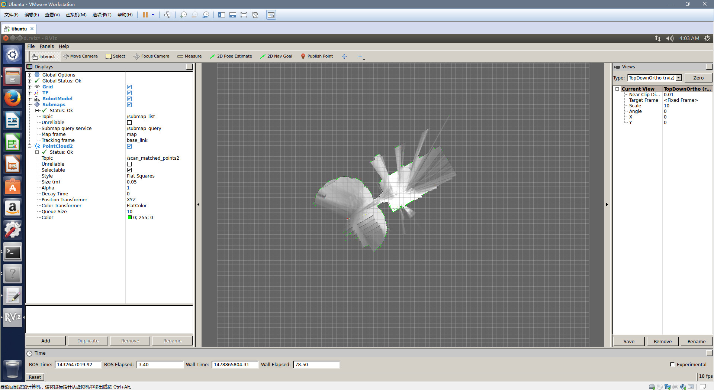

### Cartographer安装

按照流程一步步来。

#### 0.安装所有依赖项

> sudo apt-get install -y google-mock libboost-all-dev  libeigen3-dev libgflags-dev libgoogle-glog-dev liblua5.2-dev libprotobuf-dev  libsuitesparse-dev libwebp-dev ninja-build protobuf-compiler python-sphinx  ros-indigo-tf2-eigen libatlas-base-dev libsuitesparse-dev liblapack-dev

#### 1.首先安装ceres solver，选择的版本是1.11,路径随意

> git clone [https://github.com/hitcm/ceres-solver-1.11.0.git](https://github.com/hitcm/ceres-solver-1.11.0.git)
>
> cd ceres-solver-1.11.0/build
>
> cmake ..
>
> make –j
>
> sudo make install

 

#### 2.然后安装 cartographer,路径随意

> git clone [https://github.com/hitcm/cartographer.git](https://github.com/hitcm/cartographer.git)
>
> cd cartographer/build
>
> cmake .. -G Ninja
>
> ninja
>
> ninja test
>
> sudo ninja install

#### 上述第3步cmake .. -G Ninja执行错误的同学可以忽略3-6步，改用下面的方法。

> cmake  ..
>
> make
>
> sudo make install

#### 3.安装cartographer_ros。

谷歌官方提供的安装方法比较繁琐，我对原来的文件进行了少许的修改，核心代码不变，只是修改了编译文件

下载到catkin_ws下面的src文件夹下面

> git clone [https://github.com/hitcm/cartographer_ros.git](https://github.com/hitcm/cartographer_ros.git)

然后到catkin_ws下面运行catkin_make即可。

#### 4.数据下载测试

2d数据，大概500M，用迅雷下载

> https://storage.googleapis.com/cartographer-public-data/bags/backpack_2d/cartographer_paper_deutsches_museum.bag

**然后运行launch文件即可。**

> roslaunch cartographer_ros demo_backpack_2d.launch bag_filename:=${HOME}/Downloads/cartographer_paper_deutsches_museum.bag

**效果如图**

