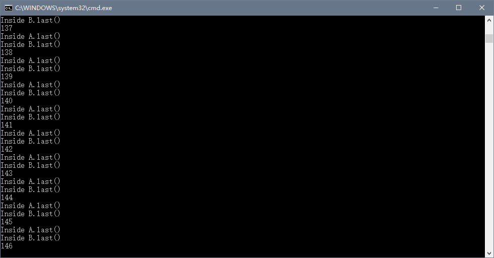

### Lab4-死锁Deadlock

#### 1.直接上截图

 

#### 2.产生死锁的四个必要条件

(1)**互斥条件**：一个资源每次只能被一个进程使用。

(2)**请求与保持条件**：一个进程因请求资源而阻塞时，对已获得的资源保持不放。

(3)**不剥夺条件**:进程已获得的资源，在末使用完之前，不能强行剥夺。

(4)**循环等待条件**:若干进程之间形成一种头尾相接的循环等待资源关系。

#### 3.对上述程序产生死锁的解释

​	因为线程t的run函数中调用了类B的对象b的methodB函数，有synchronized同步代码块，且线程的run函数一直是随机调用的，然后等待count--跑完以后，调用a.methodA(b)函数，也会调用synchronized同步代码块，所以就会被阻塞掉，也就是产生了死锁。