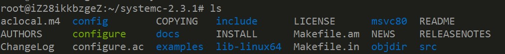
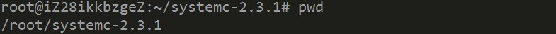
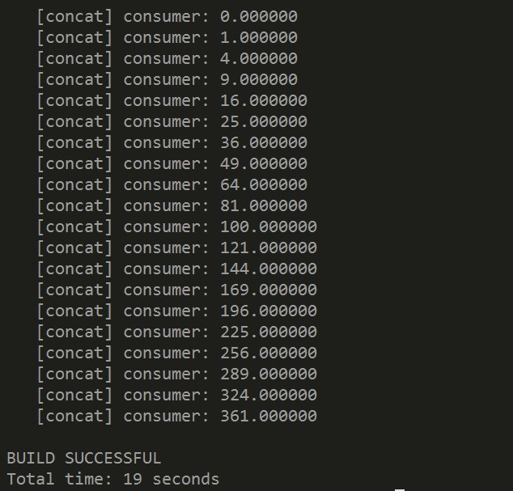

## Lab1:DOL开发环境配置

​	因为嵌入式系统实验的需求，我们需要在Ubuntu虚拟机中搭建DOL开发环境，按照教程来，只要每一步没有出错，就可以顺利配置成功。

#### 0.安装一些必要的环境(Ubuntu为例)

> $  sudo apt-get update

> $  sudo apt-get install ant

> $   sudo apt-get install openjdk-7-jdk

> $  sudo apt-get install unzip

#### 1.下载文件(使用Vmware虚拟机，也可以从主机拷贝到虚拟机中去)

[http://](http://jingyan.baidu.com/article/c33e3f48a5c153ea15cbb5b2.html)[jingyan.baidu.com/article/c33e3f48a5c153ea15cbb5b2.html](http://jingyan.baidu.com/article/c33e3f48a5c153ea15cbb5b2.html)

这个链接里是如何安装VMtools实现虚拟机和pc之间文件交流的教程。

若是在虚拟机中直接下载，分别执行以下两条指令下载压缩包。

> sudo wget [h](http://www.accellera.org/images/downloads/standards/systemc/systemc-2.3.1.tgz)[ttp://www.accellera.org/images/downloads/standards/systemc/systemc-2.3.1.tgz](http://www.accellera.org/images/downloads/standards/systemc/systemc-2.3.1.tgz)

> sudo wget [http://www.tik.ee.ethz.ch/~shapes/downloads/dol_ethz.zip](http://www.tik.ee.ethz.ch/~shapes/downloads/dol_ethz.zip)

#### 2.解压文件

新建dol的文件夹

> $  mkdirdol

将dolethz.zip解压到 dol文件夹中

> $  unzipdol_ethz.zip -d dol

解压systemc

> $  tar-zxvfsystemc-2.3.1.tgz

#### 3.编译systemc

解压后进入systemc-2.3.1的目录下

> $  cdsystemc-2.3.1

新建一个临时文件夹objdir

> $  mkdirobjdir

进入该文件夹objdir

> $  cdobjdir

运行configure(能根据系统的环境设置一下参数，用于编译)

> $  ../configureCXX=g++ --disable-async-updates

运行完configure以后terminal应该显示如下：

 

编译

> $  sudomake install

编译完后文件目录如下

> $ cd .. 
>
> $ ls

 

记录当前的工作路径(会输出当前所在路径，记下来，待会有用)

> $ pwd 

 

这里表示我当前的工作路径为 /root/systemc-2.3.1

#### 4.编译dol

进入刚刚dol的文件夹

> $  cd ../dol

修改build_zip.xml文件

找到下面这段话，就是说上面编译的systemc位置在哪里，

> <property name="systemc.inc"value="YYY/include"/>

> <property name="systemc.lib"value="YYY/lib-linux/libsystemc.a"/>

把YYY改成上页pwd的结果（注意，对于  64位 系统的机器，lib-linux要改成lib-linux64）

然后是编译

> $  ant-f build_zip.xml all

若成功会显示build successful

接着可以试试运行第一个例子

进入build/bin/mian路径下

> $  cd build/bin/main

然后运行第一个例子

> $  ant-f runexample.xml -Dnumber=1

成功结果如图

 

然后进入dol/build/bin/main/example1

> $ cd
>
> $ cd dol/build/bin/main/example1

文件夹里有一个example1.dot文件，点开此文件，如果之前没有装过dotviewer，会提示你先装上dotviewer，按照提示安装就好。最后打开example1.dot，显示如图。

 

出现这个界面，说明DOL环境已配置完成。
