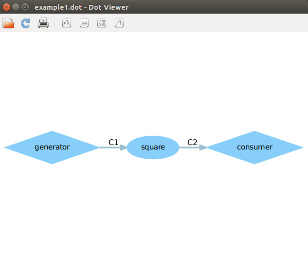
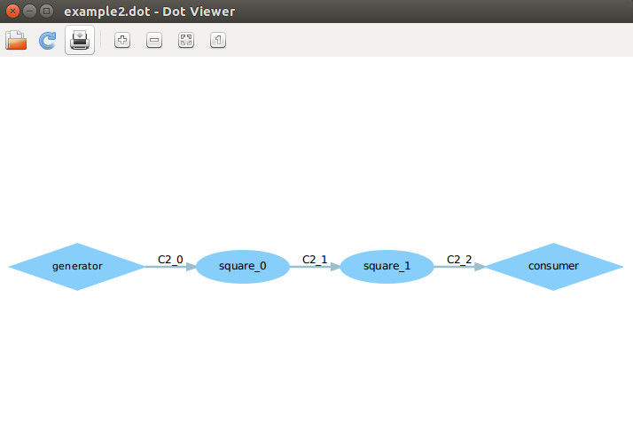

### Lab3-DOL实例分析&编程

#### 1.Example1

dot图：

 

如何修改：

​	这次修改在dot图中无法看见，直接看具体代码。因为做平方是在square.c文件中，所以直接进这个文件中进行修改。打开square.c文件，发现里面做平方的代码是i = i * i，所以要改成输出3次方数，直接将这里改成i = i * i * i即可。

>int square_fire(DOLProcess *p) {
>
>    float i;
>
>    if (p->local->index < p->local->len) {
>        DOL_read((void*)PORT_IN, &i, sizeof(float), p);
>        i = i*i*i;
>        DOL_write((void*)PORT_OUT, &i, sizeof(float), p);
>        p->local->index++;
>    }
>    
>    if (p->local->index >= p->local->len) {
>        DOL_detach(p);
>        return -1;
>    }
>    
>    return 0;
>}
>

#### 2.Example2

dot图：

 

如何修改：

​	按照PPT，直接将xml文件中的iterator的value从3改成2即可=。=

实验感想：

​	这次实验，因为比较简单而且提示很详细，所以实现很简单。主要是更熟悉了DOL是怎么使用的。